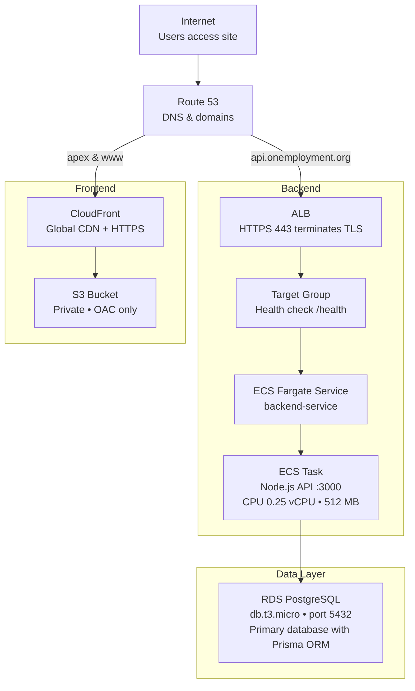

# onemployment Architecture Overview

This document provides a high-level overview of the AWS-based architecture for the onemployment platform, focusing on design patterns, resource types, and security considerations.

## Architecture Diagram

## System Overview

The onemployment platform is a modern web application built on AWS services, designed for scalability, security, and cost-effectiveness. The architecture follows a three-tier design:

- **Presentation Tier**: React SPA delivered via CloudFront CDN
- **Application Tier**: Node.js API running on ECS Fargate
- **Data Tier**: PostgreSQL for persistent data with Prisma ORM

## AWS Resources

### Compute & Container Services

- **ECS Fargate Cluster**: Serverless container hosting
- **ECS Service**: Manages container instances with health checks
- **ECR Repository**: Private container image registry
- **Application Load Balancer**: Layer 7 load balancing with SSL termination

### Data & Storage Services

- **RDS PostgreSQL**: Managed relational database for primary data
- **S3 Bucket**: Static website hosting for React frontend
- **AWS Secrets Manager**: Secure credential storage

### Networking & Security

- **VPC**: Isolated network environment
- **Public Subnets**: For load balancer and container tasks
- **Private Subnets**: For database services (network isolation)
- **Security Groups**: Firewall rules controlling traffic between services
- **Route 53**: DNS management and domain routing
- **ACM Certificates**: SSL/TLS certificates for HTTPS

### Content Delivery & Frontend

- **CloudFront Distribution**: Global CDN with custom domain support
- **Origin Access Control (OAC)**: Secure S3 bucket access
- **CloudFront Function**: Apex domain redirect handling

## Security Architecture

### Network Security

- **Defense in Depth**: Multi-layered security with VPC, subnets, and security groups
- **Private Data Layer**: Databases isolated in private subnets with no internet access
- **Least Privilege Access**: Security groups allow only necessary traffic between services
- **SSL/TLS Everywhere**: HTTPS enforcement across all public endpoints

### Access Control

- **IAM Roles**: Service-specific roles with minimal required permissions
- **AWS Secrets Manager**: Centralized credential management with rotation capability
- **Container Security**: Private ECR registry with image scanning
- **Origin Access Control**: CloudFront-only access to S3 frontend assets

### Data Protection

- **Encryption at Rest**: RDS and S3 encryption enabled
- **Encryption in Transit**: HTTPS/TLS for all client communication
- **Database Security**: PostgreSQL in private subnets with security group restrictions
- **Session Management**: JWT-based stateless authentication with secure token handling

## Traffic Flow

### Frontend Requests

1. User visits `www.onemployment.org`
2. Route 53 resolves to CloudFront distribution
3. CloudFront serves static assets from S3 bucket via OAC
4. React SPA handles client-side routing

### API Requests

1. Frontend makes API calls to `api.onemployment.org`
2. Route 53 resolves to Application Load Balancer
3. ALB terminates SSL and forwards to ECS service
4. ECS Fargate containers process requests
5. Backend connects to PostgreSQL (data) with Prisma ORM

## Cost Optimization

- **Free Tier Utilization**: Designed to maximize AWS Free Tier benefits
- **Right-Sized Resources**: Minimal compute resources for current load
- **Serverless Components**: Pay-per-use pricing with ECS Fargate
- **Efficient Caching**: CloudFront CDN reduces backend load

## High Availability & Resilience

- **Multi-AZ Deployment**: Resources spread across multiple availability zones
- **Auto Scaling**: ECS service can scale based on demand
- **Health Monitoring**: Load balancer health checks ensure service availability
- **Backup Strategy**: RDS automated backups and point-in-time recovery
- **CDN Redundancy**: CloudFront global edge locations for frontend delivery

## Development & Deployment

- **CI/CD Pipeline**: Automated builds and deployments via GitHub Actions
- **Container Strategy**: Docker-based deployments with blue/green updates
- **Environment Separation**: Infrastructure designed for dev/staging/prod environments
- **Infrastructure as Code**: Architecture documented for reproducible deployments
